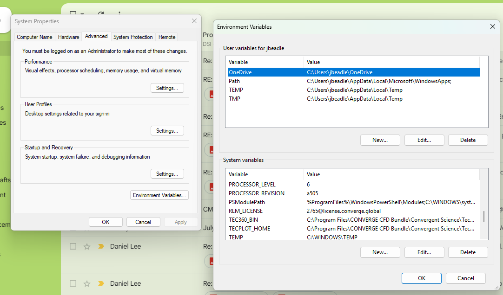

On Windows
==========

Installing the CONVERGE CFD software suite (which includes the CONVERGE solver, CONVERGE Studio, and post-processing tools) on Windows involves downloading the unified bundle, selecting your component preferences, and configuring licensing.

Download the Bundle Installer
-----------------------------

1. Go to the `Convergent Science Hub Download Portal <https://hub.convergecfd.com/downloads>`_ and sign in:

2. Download the unified executable bundle (e.g., ``CONVERGE_CFD_Bundle_5.x.x_win64.exe`` or ``CONVERGE_CFD_Bundle_4.x.x_win64.exe``).

3. (Optional) If you are upgrading from an older patch of the same major version, run the uninstaller for the previous patch first to prevent global environment variable conflicts.

Run the Installer Wizard
------------------------

This steps requires Administrator Access. Please consult with lab advisor or ODU IT support team if you are using ODU-managed computer.

1. Right-click the .exe installer file and select Run as Administrator.

2. Choose the installation path (default: ``C:\Program Files\CONVERGE CFD Bundle`` or ``C:\Program Files\Convergent Science``).

3. Select the software products to install:

   - **CONVERGE** (Solver)
   - **CONVERGE Studio** (Gui for pre-processing/post-processing)
   - **Examples** (Sample case files)
   - **Tecplot** for CONVERGE (Post-processing software)

4. Select your preferred MPI implementation for parallel processing (Microsoft MPI or Intel MPI).

5. Complete the setup wizard. If prompted to install Microsoft MPI (MS-MPI) at the final screen, keep it checked and complete that installation as well.

Configure the License
---------------------

The RLM license server is running elsewhere (on the ODU HPC network), you need to tell your Windows where the license server is. To do this job, you should create an **environment variable** for RLM in your Windows system.

**Step 1. Open Environment Variables**

1. Press **Windows Key**

2. Search **"Environment Variables"**

3. Open **Edit the system environment variables**

4. Click **Environment Variables**

**Step 2. Create RLM_LICENSE**

1. Under **System Variables**, Click **New**

2. Set **Variable Name:** as **RLM_LICENSE**

3. Location: **2765@server_hostname_or_ip**

The correct RLM_LICENSE server ip will be updated. The server is under way as of 08/29/2026.

For more detailed instructions, please refer to the `Getting Started Guide` available in the documentation folder for each CONVERGE version.
