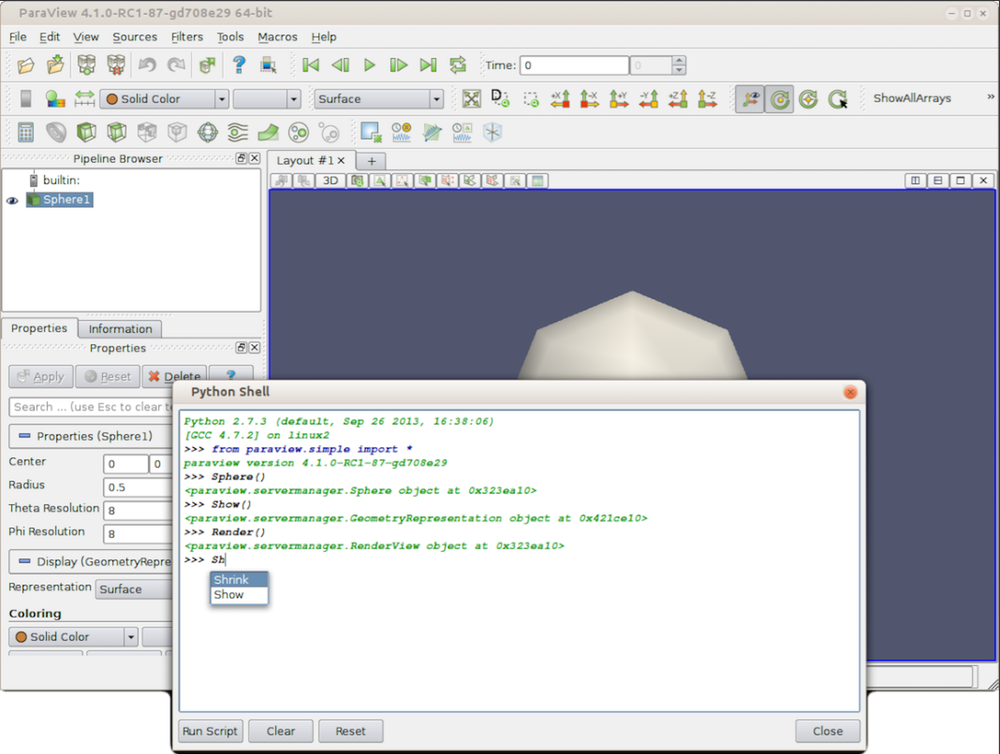

========
PVpython
========

**pvpython** is the standalone Python interpreter executable bundled directly with ParaView. It pre-loads ParaView's libraries (such as ``paraview.simple``), allowing you to run ParaView scripts in "headless" mode without launching the graphical user interface (GUI).

Key Use Cases
=============

* **Batch Data Processing**: Automatically process hundreds of simulation output files (e.g., slicing, computing derivatives, exporting CSVs) in loop scripts on a cluster.

* **Off-Screen Image & Movie Generation**: Render 3D visualizations, screenshots, and animations on remote high-performance computing (HPC) nodes that lack a desktop environment.

* **Script Trace Execution**: Run scripts generated by ParaView's "Trace" feature—where actions performed in the desktop GUI are recorded directly into Python code.

Basic Example Script
====================

A typical script run via ``pvptyhon my_script.py`` looks like this:

.. code-block:: python
   :caption: Python script snippet

   from paraview.simple import *

   # Create a source (sphere)
   sphere = Sphere()

   # Apply a filter (elevation)
   elevation = Elevation(Input=sphere)
   
   # Render and save an image off-screen
   renderView = GetActiveViewOrCreate('RenderView')
   Show(elevation, renderView)
   SaveScreenshot('output.png', renderView)

